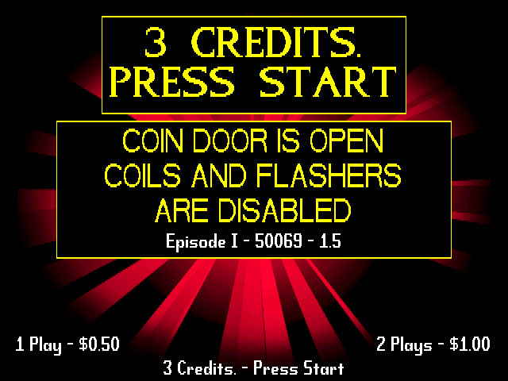
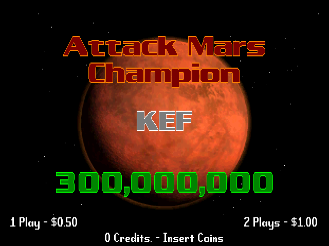

# Encore — a Pinball 2000 Emulator

Encore is a clean-room, single-binary x86 emulator targeting the
Williams **Pinball 2000** platform (the games **Star Wars: Episode I**
and **Revenge from Mars**). It bundles everything needed to boot the
included update packages and exercise the full display + audio + LPT
pipeline from a single self-contained folder.

<p align="center">
  
  &nbsp;
  
</p>
<p align="center"><sub>Encore running the official Williams updates SWE1 v1.5 (left) and RFM v1.8 (right) — no community / mypinballs assets included. See <a href="docs/47-community-updates.md">community updates</a> for the post-2003 mypinballs builds.</sub></p>

<p align="center">
  <a href="docs/README.md"><strong>📚 Documentation Index →</strong></a>
  &nbsp;·&nbsp;
  <a href="docs/02-quickstart.md">Quickstart</a>
  &nbsp;·&nbsp;
  <a href="docs/03-cli-reference.md">CLI Reference</a>
  &nbsp;·&nbsp;
  <a href="docs/42-cabinet-testing-call.md">Help us test on real hardware</a>
</p>

---

## ⚠️  Project status — read this first

**Encore has never been tested on a real Pinball 2000 cabinet.**

Every behavioural claim in this repository — graphics rendering, DCS
audio, switch matrix handling, lamp / coil drive — has been validated
**only** against our internal emulation harness using the seven
dearchived update bundles shipped under `updates/`. The emulator
boots all of them, exercises the boot scheduler, runs the XINA OS,
loads symbols, primes the DCS sound pipeline, and produces the
expected probe-handshake traffic on the parallel port.

That is a meaningful milestone, but it is **not** the same as
"works on a real machine". On real hardware:

* timings are unforgiving and can expose races our harness silently
  tolerates;
* the parallel port talks to actual switch and lamp boards whose
  electrical behaviour we can only approximate;
* the DCS-2 sound subsystem talks to a real audio DAC, not SDL2_mixer;
* a real cabinet has wear, leaky capacitors, stuck switches, dimming
  bulbs and other realities that no emulator can predict.

So treat every "works" / "supported" / "stable" you read here as
**"behaves as expected in our emulator and is therefore expected to
work on real hardware — but verification is pending"**.

If you have access to a Pinball 2000 cabinet (or even just the
mainboard on a bench) and would like to help us close that gap, please
read **[docs/42-cabinet-testing-call.md](docs/42-cabinet-testing-call.md)**
— there is a short report template and a list of what we'd love you to
exercise.

---

## What Encore is, in one screen

Encore loads the exact ROM and update files Williams shipped for a
Pinball 2000 head, boots them inside a self-contained Unicorn-driven
i386 virtual machine, and renders the resulting 640×240 framebuffer to
an SDL window while pumping the game's DCS-2 command stream to an
SDL_mixer audio backend. It is a single ~800 KB native ELF — no
interpreter, no Python runtime, no kernel module: copy the binary,
point it at a ROM folder, and run.

The design is **authenticity through simplicity**:

* boot the *real* game binary, not a reimplementation;
* run from untouched ROM images (the flash update is assembled on disk
  the same way Williams' own service installer would have assembled it);
* emulate only the hardware the game actually touches — MediaGX config
  registers, the PLX 9050 bridge, the PRISM BAR0–BAR5 window, DCS-2
  PCI audio, the LPT driver-board protocol and the COM1 UART; everything
  else returns a safe default.

### Goals (in priority order)

1. **Correct boot on every dearchived bundle.** Seven update bundles
   pulled from the wild — SWE1 v1.5 / v2.1 and RFM v1.2 / v1.6 / v1.8 /
   v2.5 / v2.6. Six of the seven reach attract mode with full graphics
   and DCS audio; the oldest (RFM v1.2, 1999) dies pre-XINU and is
   documented separately (see [docs/26](docs/26-testing-bundle-matrix.md)).
2. **Single binary, zero dynamic discovery.** No per-bundle JSON blob,
   no Python plug-ins, no per-game `#ifdef`. Every bundle-specific
   offset is either pattern-scanned at boot or looked up through the
   update's own `SYMBOL TABLE`.
3. **Real-cabinet compatible.** `--lpt-device /dev/parport0` forwards
   every LPT access to a physical Pinball 2000 driver board; the
   emulated switch matrix falls silent so the real playfield owns I/O.
4. **Small, legible, hackable.** ≈ 8 000 lines of C across thirteen
   files. Any technically-minded contributor should be able to read the
   entire source in an afternoon.

For the deeper architecture diagram, the per-subsystem walkthroughs and
the full design rationale, see **[docs/01-overview.md](docs/01-overview.md)**.

---

## Quick start

Prerequisites (Debian 12 / Ubuntu 24.04 reference):

```sh
sudo apt install -y build-essential pkg-config \
                    libsdl2-dev libsdl2-mixer-dev libunicorn-dev
```

Build and run:

```sh
git clone https://github.com/ThomazPom/Encore-Pinball2000.git encore && cd encore
make                                                     # → ./build/encore
./build/encore --game swe1                                # SWE1 with default settings
./build/encore --update 0150                              # SWE1 v1.5 (canonical 4-digit token)
./build/encore --update 0180 --dcs-mode bar4-patch        # RFM v1.8, legacy BAR4-patch DCS
./build/encore --update latest --game rfm                 # newest bundled RFM (v1.8)
```

> **Connecting a real cabinet?** Encore runs unprivileged through Linux
> `ppdev` (no setuid, no `ioperm`); you just need to be in the `lp`
> group with the kernel `lp` printer driver out of the way:
> `sudo modprobe ppdev parport_pc; sudo rmmod lp 2>/dev/null; sudo usermod -aG lp $USER && newgrp lp`
> — `newgrp` activates the group in the current shell, no logout. Full
> setup and the no-`sudo`-yet bootstrap in
> [docs/02-quickstart.md](docs/02-quickstart.md#real-cabinet-prerequisites-skip-if-emulator-only)
> and [docs/19-real-lpt-passthrough.md](docs/19-real-lpt-passthrough.md).

The chip ROMs (`./roms/`) and every dearchived original Williams update
bundle (`./updates/`) ship with the repo — no extra downloads needed
for the default games. Community/post-Williams updates (e.g.
mypinballs.com's enhanced firmware with extra fixes and effects) are
not redistributed here; Encore supports them at runtime — see
[docs/47-community-updates.md](docs/47-community-updates.md) for how
to install them and grab the latest versions directly from
<https://mypinballs.com>.

Other useful entry points are documented in
[docs/02-quickstart.md](docs/02-quickstart.md) and
[docs/03-cli-reference.md](docs/03-cli-reference.md).

---

## Folder layout

```
Encore-Pinball2000/
├── Makefile
├── README.md                  ← you are here
├── build/                     ← build artefacts (created by `make`)
├── include/                   ← the single shared header
├── src/                       ← C sources (no generated files)
├── tools/                     ← helper scripts (sym_dump, build_update_bin, …)
├── roms/                      ← bundled chip ROMs, BIOS, sound containers
├── updates/                   ← 7 dearchived update packages
└── docs/                      ← full documentation tree
```

`roms/` and `updates/` contain everything Encore needs to boot the
bundled games out of the box; no external file lookups, no network
calls, no implicit `$HOME`/`$XDG_*` behaviour.

---

## Highlighted CLI flags

| Flag | Purpose |
|------|---------|
| `--game swe1\|rfm\|auto` | Pick title; `auto` infers from the active ROM set |
| `--update <path\|version>` | File, directory, `.exe`, or version token (`210`, `2.6`, `latest`) |
| `--dcs-mode io-handled\|bar4-patch` | DCS sound pipeline selector (default: `io-handled`) |
| `--headless` | Run without opening a window (CI / smoke testing) |
| `--fullscreen` / `--flipscreen` / `--bpp N` | Display tweaks |
| `--splash-screen none\|PATH` | Personalise the startup splash (or drop a JPEG into `assets/splash-screen.jpg` before `make` — see [docs/49-splash-screen.md](docs/49-splash-screen.md)) |
| `--no-savedata` | Skip NVRAM / SEEPROM load (clean boot) |
| `--config FILE` | Load options from a YAML config |
| `--lpt-device /dev/parport0` | Forward the guest's LPT to a real parallel port (cabinet only) |

See [docs/03-cli-reference.md](docs/03-cli-reference.md) for the
complete list and
[docs/41-build-env-and-runtime.md](docs/41-build-env-and-runtime.md)
for environment variables and runtime knobs (keyboard shortcuts,
SDL_*, DISPLAY, debug toggles).

---

## Documentation

Start with **[docs/README.md](docs/README.md)** for the indexed
reading order. There are 40+ documents grouped by subsystem
(architecture, ROM pipeline, CPU, DCS sound, LPT, display, build,
testing, hardware primer, XINA OS, …). The first three docs read
linearly; everything else is reference material you can dip into.

---

## Side quests along the way

This project started with a few "nice to have" goals on the side, in
addition to the main objective of booting the game. Here is what
happened to each of them in the end:

* **Decoding the DCS sound libraries** (`*_P2K.bin`).
  Originally a side quest because no documented decoder existed, and
  also a personal one: I wanted to hear some of the sounds from my
  dad's pinball outside of an actual game. Implemented in
  `tools/extract_sounds.py` — 689 samples come out of SWE1 in seconds.
  The format turned out to be far simpler than feared (a header, a
  fixed-size entry table, then the concatenated samples), so the tool
  is now in the toolbox even though it is not strictly required to
  run the game.
* **Extracting the symbol table from update bundles**.
  Same story: was expected to be hard, ended up being a 200-line
  walker. Lives in `src/symbols.c` for runtime use and
  `tools/sym_dump.py` for offline inspection. This one *did* end up
  being central — every ROM-agnostic patch in Encore relies on it.
* **Reinterleaving raw chip-by-chip ROM dumps**.
  Documented and scripted in `tools/deinterleave_rebuild.sh`, so anyone
  with eight `uXXX.rom` files from a real PROM dumper can rebuild a
  loadable bank without guessing the byte layout.
* **Round-tripping Williams' update installers**.
  The `.exe` self-extractors are renamed ZIPs; Encore detects them and
  rebuilds the 4 MB `update.bin` exactly the way Williams laid it out.
  `tools/build_update_bin.py` produces byte-identical output from a
  bundle directory.
* **TCP serial console + TCP keyboard injection**.
  Born from the need to script regression runs without an SDL window.
  Now `--serial-tcp` is the proven way to drive XINA from a script,
  and `--headless --serial-tcp` is how the regression matrix runs.
* **Real LPT passthrough to a physical driver board**.
  Ended up as `--lpt-device /dev/parport0`, with all the kernel-module
  setup documented. Still waiting for cabinet validation, but the
  emulation-side protocol is in place.

---


We are actively looking for:

* **Cabinet testers** — see
  [docs/42-cabinet-testing-call.md](docs/42-cabinet-testing-call.md).
* **Mainboard / bench testers** — even partial setups (just the LPT
  loop, just the DCS audio path) are extremely useful.
* **Bug reports** with logs from `--update <ver> --headless` runs that
  fail to boot or produce incorrect behaviour.
* **Compatibility reports** for additional update bundles we don't
  yet ship.

Please open an issue on the project's repository (or contact the
maintainer through the channel listed in your distribution channel)
and include:

```
Game/version :
Bundle path  :
CLI invoked  :
Host OS      :
What worked  :
What didn't  :
Last 50 lines of stdout :
```

---

## Licensing & credits

The Encore source code in `src/`, `include/`, `tools/` and `docs/` is
original work intended for free release. The bundled ROMs and update
packages under `roms/` and `updates/` are the property of their
respective rights-holders and are included for testing convenience;
remove them if you intend to redistribute Encore in a context that
does not have permission to include them.

The XINA operating system inside the bundles is itself a derivative
of Comer's XINU; see [docs/44-xina-os-deep-dive.md](docs/44-xina-os-deep-dive.md)
for context.
