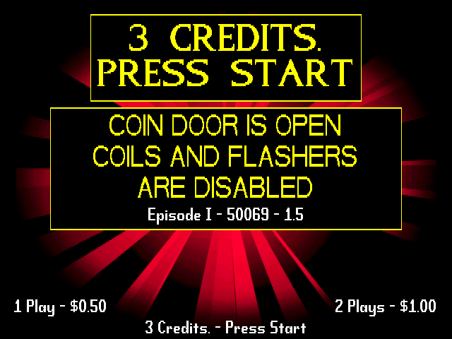
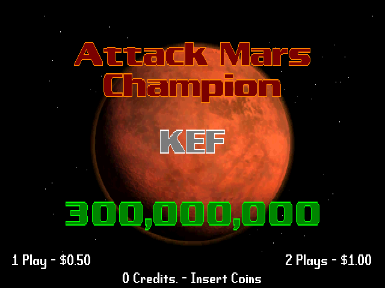

# Encore — a Pinball 2000 QEMU Machine

Williams Pinball 2000 firmware running inside upstream QEMU.

<p align="center">
  
  &nbsp;
  
</p>

<p align="center">
  <a href="docs/README.md"><strong>Documentation Index</strong></a>
  &nbsp;|&nbsp;
  <a href="docs/02-quickstart.md"><strong>Quickstart</strong></a>
  &nbsp;|&nbsp;
  <a href="docs/04-troubleshooting.md">Troubleshooting</a>
  &nbsp;|&nbsp;
  <a href="docs/29-cabinet-testing-call.md">Real Hardware Testing</a>
  &nbsp;|&nbsp;
  <a href="docs/35-known-limitations.md">Known Limitations</a>
  &nbsp;|&nbsp;
  <a href="docs/36-roadmap.md">Roadmap</a>
</p>

---

## Status

> [!IMPORTANT]
> **Encore boots both Star Wars Episode I and Revenge from Mars to attract mode with graphics, DCS audio, AND persistent savedata via exit-time flush.** BAR3 flash and BAR2 NVRAM are saved atomically on exit (disable with `P2K_NO_SAVEDATA=1`). Real-cabinet validation is pending. If you own a Pinball 2000 cabinet, see [docs/29-cabinet-testing-call.md](docs/29-cabinet-testing-call.md) to help us verify that what works in emulation also works on wire.

> [!WARNING]
> **Real-cabinet support is still under active validation.** Emulator-only behaviour and real driver-board behaviour are not the same thing: cabinet timing, LPT electrical details, switch reads, lamps, coils, and DCS hardware all need real-machine confirmation. Do not connect a physical cabinet without reading the testing call document first.

> [!NOTE]
> **Savedata persistence works.** Encore loads `.nvram2` (128 KiB NVRAM), `.flash` (4 MiB update flash), and `.see` (128 B 93C46 SEEPROM) at boot and flushes them atomically on exit via `qemu_add_exit_notifier`. High scores, audits, installed updates, and cabinet config survive across runs. Only EMS (`.ems`) is not yet modelled — see [docs/09-savedata.md](docs/09-savedata.md) for details.

---

## What is Encore?

Williams and Bally shipped the last official Pinball 2000 firmware in
September 2003. The community kept the platform alive through Jim Askey's
mypinballs.com updates, but running those updates required the original
1999 MediaGX hardware — until now.

Encore is a QEMU machine implementation that boots the original Pinball 2000
i386 game binary on modern Linux hardware. It emulates the Cyrix MediaGX CPU,
the PLX 9054 PCI bridge, the DCS audio coprocessor, the parallel-port driver
board, and enough of the surrounding chipset to convince the game it's
running on the real thing.

The result: both Star Wars Episode I and Revenge from Mars boot to attract
mode, render 640×240 RGB555 graphics at 57 Hz, play DCS audio, and respond
to keyboard input through an emulated switch matrix. Cabinet passthrough for
real driver boards is designed but not yet connected; desktop validation is
complete, wire validation is the open gate.

> [!NOTE]
> **The Unicorn → QEMU pivot:** Encore began as a vendored Unicorn Engine single-binary emulator. It booted the ROMs but was a maintenance dead-end — vendored CPU engine, custom build, no upstream improvements. We pivoted to upstream QEMU + a small set of machine files in `qemu/` so we ride QEMU's mainline (TCG, SDL/GTK, debug tooling) for free and only own the Pinball-2000-specific hardware models. Engine-agnostic notes from the Unicorn era are preserved in `docs/` — they describe the firmware/hardware, not the emulator.

---

## Read first

| Document | What you learn |
|---|---|
| [02 — Quickstart](docs/02-quickstart.md) | How to build from source and run your first game — the shortest path from clone to attract mode. |
| [04 — Troubleshooting](docs/04-troubleshooting.md) | Common boot failures, cryptic error messages, and how to fix them — the "it didn't work, now what?" guide. |
| [29 — Cabinet Testing Call](docs/29-cabinet-testing-call.md) | Why we need your help if you own real hardware — the gap between "boots in QEMU" and "drives a 500-pound pinball cabinet without catching fire." |
| [35 — Known Limitations](docs/35-known-limitations.md) | The truthful list of what doesn't work yet — EMS persistence, real LPT passthrough, cabinet timing — so you know what to expect before filing a bug. |
| [36 — Roadmap](docs/36-roadmap.md) | Where the project is going — the short-term validation tasks, the mid-term symptom-patch removals, and the long-term cabinet proof gate. Success looks like zero active patches and a real driver board booting to attract. |

> [!TIP]
> New to the project? Read documents 02 and 35 first. That's the "how to run it" and "what doesn't work yet" pair that answers 90% of first-time questions.

---

## What's in the repo

| Path | Purpose |
|---|---|
| `qemu/` | QEMU machine files for Pinball 2000 — the PLX PCI bridge, the MediaGX display controller, the DCS audio device, the LPT driver board emulation, and the machine init glue. Compiled into QEMU by `scripts/build-qemu.sh`. |
| `scripts/` | Build and launch wrappers — `build-qemu.sh` compiles upstream QEMU with our patches, `run-qemu.sh` handles ROM paths and savedata directories. |
| `docs/` | Long-form documentation grouped by subsystem — how it boots, how hardware is emulated, what still needs cabinet validation, and where the project is going. |
| `roms/` | Chip ROM binaries for Star Wars Episode I and Revenge from Mars. These are the baseline images that shipped on physical EPROMs; update bundles under `updates/` overlay newer code into flash. |
| `updates/` | Official Williams update bundles and community mypinballs.com updates, organised by game ID and version. Encore auto-discovers the newest bundle at boot unless you pass `--update <version>` explicitly. |
| `savedata/` | Runtime state files — `.nvram2` (audits, high scores), `.flash` (code image), `.see` (93C46 SEEPROM cabinet config), `.ems` (service flags). Created at first run; **`.nvram2`, `.flash`, and `.see` are persisted atomically on exit** via QEMU exit notifiers. EMS not yet modelled. |
| `tools/` | Symbol-dump scripts, ROM de-interleave helpers, and DCS audio extraction tools used during development. |

> [!NOTE]
> Earlier in the project's life there was a vendored Unicorn-based single-binary emulator. It has been retired in favour of upstream QEMU plus the machine files under `qemu/`. Engine-agnostic notes from that era were folded into the docs in `docs/`.

---

## Quickstart

> [!IMPORTANT]
> **Use the maintained quickstart: [docs/02-quickstart.md](docs/02-quickstart.md)**
>
> The root README intentionally avoids dependency lists, version pins, and cabinet setup recipes. Those details change quickly and belong in the quickstart and subsystem docs.

For impatient first-timers after reading the quickstart:

```sh
git clone https://github.com/ThomazPom/Encore-Pinball2000.git
cd Encore-Pinball2000
./scripts/build-qemu.sh      # Compiles QEMU with P2K machine; takes 5-10 minutes
./scripts/run-qemu.sh swe1   # Boots Star Wars Episode I with auto-discovered update
```

Press `SPACE` or `S` to inject Start button, `ESC` to quit.

> [!TIP]
> Running on a real cabinet, or wondering which timing knobs to set? The answer
> is "none" — see **[docs/47 — Recommended Configuration (The Golden Path)](docs/47-recommended-configuration.md)**.
> The plain baseline is the measured-best configuration; every experimental
> timing lever is worse.

> [!TIP]
> If the build fails with missing dependencies, the quickstart document lists every Ubuntu/Debian package you need. If you're on Fedora or Arch, the package names are slightly different but the list is the same.

---

## Where to go next

The [**documentation index**](docs/README.md) is your map. It groups the 45
subsystem docs into sections (getting started / the story / how it boots /
hardware emulation / investigations and quirks / symptom patches / operations
/ roadmap and reference) so you can jump straight to what interests you.

If you want to understand the journey — how Encore was built, what was
discovered along the way, and why the codebase is structured the way it is —
start with [**05 — Genesis and Story**](docs/05-genesis-and-story.md). It's
the chronological account of first boot, the graphics milestone, the DCS
audio polarity discovery, and the minimisation pass that removed every patch
that could be replaced with clean device behaviour.

If you just want to run the thing and tweak flags, see
[**03 — CLI Reference**](docs/03-cli-reference.md) for every option the
launcher understands.

---

## Community and credits

Williams and Bally built Pinball 2000 in 1999. The platform shipped two
titles — Star Wars Episode I and Revenge from Mars — and was discontinued in
2000 when the parent company filed for bankruptcy. The last official firmware
update was released in September 2003.

**Jim Askey** at [**mypinballs.com**](https://mypinballs.com) has maintained
community firmware updates since then, fixing bugs, adding lighting effects,
and improving audio and gameplay. Those updates are fully supported by Encore
and included in regression testing. We do not redistribute them — download
directly from Jim's site to get the latest versions and support the work that
keeps Pinball 2000 alive.

> [!IMPORTANT]
> **Community updates from mypinballs.com are first-class supported.** Encore's validation matrix includes them. If a community update doesn't boot, that's a bug — file it the same way you would for an official Williams update.

The original Williams Pinball 2000 engineering team designed a remarkable
piece of hardware. Encore owes its existence to their work, to the
diagnostic ROM fragments they left behind, and to the community
reverse-engineering notes that taught us how the LPT driver board protocol
works.

Encore itself is built on top of **upstream QEMU** and inherits decades of
CPU emulation and device modelling work from that project. The Pinball 2000
machine files are thirteen C files totalling ~8000 lines; QEMU itself is
millions of lines. We stand on giants.

---

## License

Encore is released under the **GPL-3.0 license** to match QEMU's license.
See `LICENSE` in the repository root.

The Pinball 2000 ROM images under `roms/` and the update bundles under
`updates/` are copyrighted by Williams Electronics Games, Inc. (later Midway
Games, later Warner Bros. Interactive Entertainment). They are not
redistributed in source form; users must supply their own ROM dumps or
download updates from mypinballs.com.

The diagnostic source fragments under `docs/references/PinballDiag/` are
preserved for historical and educational purposes under fair use. They are
not part of Encore's source tree and are not compiled into the emulator.

> [!NOTE]
> **ROM images are not included in Git.** The `roms/` directory exists in the repository layout but the actual `.bin` files are `.gitignore`'d. See the quickstart for how to populate them.

---

← [Back to docs index](docs/README.md)
