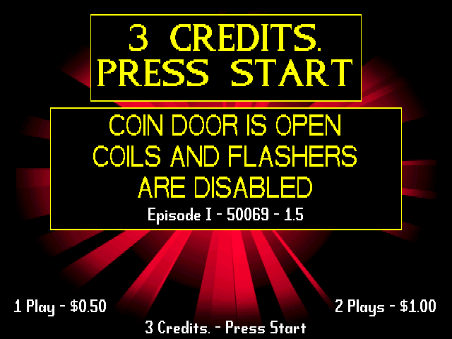
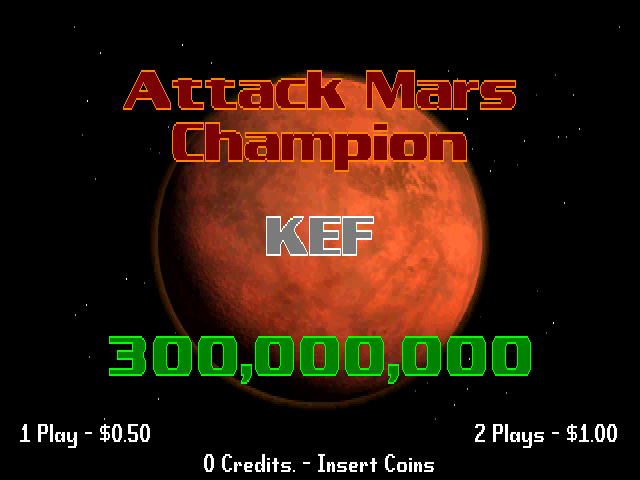

# Encore Pinball 2000

Encore runs Williams Pinball 2000 software on a custom QEMU `pinball2000`
machine. Both released games—Star Wars Episode I and Revenge From Mars—boot to
attract mode with graphics, DCS audio and emulated desktop cabinet controls.

<p align="center">
  
  &nbsp;
  
</p>

## Why Encore?

Pinball 2000 combines a late-1990s PC platform with cabinet-specific display,
sound and driver-board hardware. Encore preserves that environment: the
original game software runs inside the emulator; this is not a remake of its
rules or presentation.

## Run it

On a Linux desktop:

```bash
git clone https://github.com/ThomazPom/Encore-Pinball2000.git
cd Encore-Pinball2000
./scripts/run-qemu.sh
```

The launcher prepares missing dependencies and assets, then offers to build
the matching custom QEMU or download the latest verified x86_64 release
binary. Stock distribution QEMU does not contain this machine.

> [!NOTE]
> The first run can take longer and may request permission to install runtime
> packages. Later runs reuse the prepared QEMU, ROM/update trees and savedata.

Common choices:

```bash
# Pick a game explicitly
./scripts/run-qemu.sh --game swe1
./scripts/run-qemu.sh --game rfm

# Prepare the host without launching the guest
./scripts/run-qemu.sh --preflight

# Show every supported option
./scripts/run-qemu.sh --help
```

With the emulated board, `C` inserts a coin, `S` starts, `F7`/`F8` are the
flippers, `F4` toggles the coin door, arrow up/down controls volume and `F1`
quits cleanly.

Continue with the [Quickstart](docs/02-quickstart.md) for update and savedata
choices, or [Cabinet installation](docs/01-cabinet-installation.md) for a
dedicated boot-to-game system.

## What is implemented

- MediaGX CPU/display behavior required by the games, including blits and
  direct presentation;
- base ROM and extracted update loading with persistent cabinet state;
- natural i8254/IRQ0 delivery with timing, nesting and IStack diagnostics;
- shared DCS protocol plus original-firmware and sample/cache audio engines;
- emulated desktop controls and staged real parallel-port passthrough;
- optional SMC8416-compatible guest networking;
- XINA serial access, repeatable console scripts and live crash capture;
- installer profiles for display-manager, direct SDL2/KMSDRM, Cage and Weston
  cabinet sessions.

This is an active preservation emulator, not a claim of complete hardware or
cabinet equivalence. See [Compatibility and support](docs/30-compatibility-support.md)
and [Known limitations](docs/35-known-limitations.md) before relying on an
experimental or physical path.

## Documentation

The [documentation index](docs/README.md) groups the full set by task.
Useful maintainer entry points are:

- [Architecture](docs/10-architecture.md)
- [CPU, PIT and IRQ0 timing](docs/12-cpu-and-timers.md)
- [Testing and validation](docs/26-testing-validation-matrix.md)
- [Development guidelines](docs/05-development-guidelines.md)
- [Release process](docs/47-release-process.md)
- [`qemu/` source map](qemu/README.md)

## Releases and assets

The published Linux x86_64 archive contains the runner, installer,
documentation and custom QEMU binary. It intentionally excludes ROMs, update
payloads and savedata; a fresh installation uses the same first-run asset path
as a checkout.

> [!WARNING]
> Emulator support for an asset is not a licence grant. The repository does
> not yet carry a project-level licence or complete third-party asset notice
> inventory. Read [update provenance and redistribution](docs/47-community-updates.md)
> before packaging or mirroring material.

Build and release details are in the [release process](docs/47-release-process.md).

## Development

The project keeps Encore's machine sources out of the upstream QEMU tree. The
builder downloads a pinned source archive, applies versioned zero-fuzz patch
families, grafts the machine under `hw/i386/` and builds only
`qemu-system-i386`:

```bash
./scripts/build-qemu.sh
python3 -m unittest discover -s scripts/tests -p 'test_*.py'
python3 guest-extensions/check-romset.py
```

Read the [development guidelines](docs/05-development-guidelines.md) before
changing guest-visible behavior. Measurements, normal interactive behavior
and physical-cabinet claims have different proof requirements.
